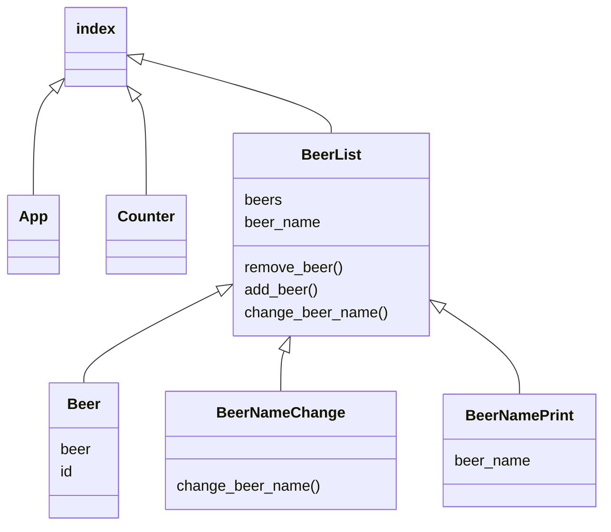

# Rapport projet REACT
Inès TOUATI - Killyan BOUR

## Structure

## Porblèmes avec react-router-dom

Son utilisation (l'appel de n'importe quelle de ses methodes) rajoute plusieurs erreurs soit incompréhensibles, soit à tord. L'utilisation des routes est dans le composant App.
Son appel dans index est commenté pour que l'application puisse fonctionner.

